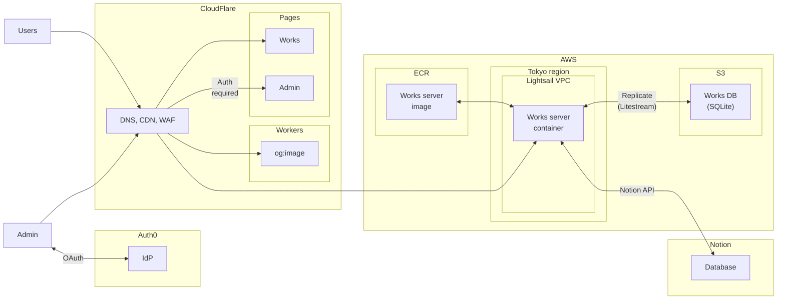

# portfolio

## Diagrams

### Architecture



## Setup

```bash
# TODO: set up .env

docker-compose build --no-cache
pnpm install --frozen-lockfile --prefix node

cd schemas
./codegen.sh {project-name} {language}
```

## deploy

```bash
# in build server
./login.sh
./push-ecr.sh

# client
cd node
pnpm build

# in production server
./login.sh
./deploy.sh
```
