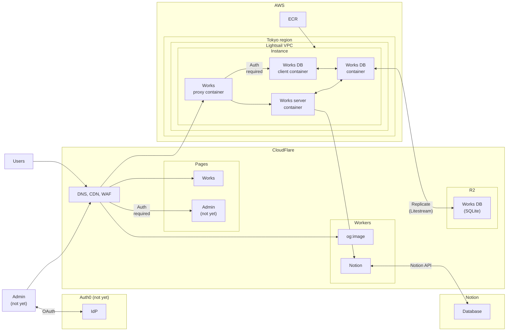

# portfolio

- URL: https://ichi-h.com
- storybook: https://portfolio-ui-40i.pages.dev

## Diagrams



## Technology Stack

- Container technology
  - Docker
- Main libraries
  - F#
    - Minimal API
  - Node
    - TypeScript
    - Remix (React)
    - vanilla-extract
    - Hono
- Database
  - SQLite
  - Litestream
- Proxy server
  - Nginx
- Cloud services
  - AWS
    - Lightsail
    - ECR
  - Cloudflare
    - Pages & Workers
    - DNS
    - R2
- IDaaS
  - Auth0 (not yet)

## Packages

- db-client
  - SQL client for SQLite DB.
- db-manager
  - Database replication system in SQLite + Litestream.
- fsharp
  - Business logic in F#.
- nginx
  - Reverse proxy server for db-client and fsharp.
- node
  - Presentation layer for each server, design system, UI library, and small API servers.

## Setup

```bash
# TODO: set up .env

docker-compose build --no-cache
pnpm install --frozen-lockfile --prefix node

cd schemas
./codegen.sh {project-name} {language}
```

## develop

```bash
docker-compose up -d
cd node
pnpm dev
```

## deploy

```bash
# in build server
./login.sh
./push-ecr.sh

# client
cd node
pnpm build
pnpm run deploy

# in production server
./login.sh
./deploy.sh
```
