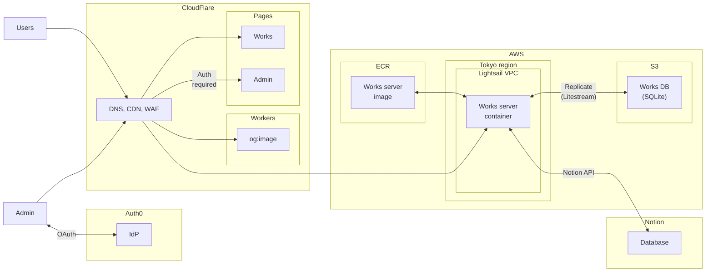

# portfolio

## Diagrams

### Architecture



## Setup

```bash
# TODO: set up .env

docker-compose build --no-cache
pnpm install --frozen-lockfile --prefix node

cd schemas
./codegen.sh {project-name} {language}
```

## build

TODO: Automate this process

```bash
# server
source .env
docker-compose -f docker-compose_prod-build.yaml build

aws configure
aws ecr get-login-password --region ap-northeast-1 | docker login --username AWS --password-stdin ${AWS_ACCOUNT_ID}.dkr.ecr.ap-northeast-1.amazonaws.com
docker tag portfolio-db-manager:latest ${AWS_ACCOUNT_ID}.dkr.ecr.ap-northeast-1.amazonaws.com/portfolio-db-manager:latest
docker tag portfolio-works-server:latest ${AWS_ACCOUNT_ID}.dkr.ecr.ap-northeast-1.amazonaws.com/portfolio-works-server:latest

docker-compose -f docker-compose_prod-build.yaml push

# client
cd node
pnpm build
```

## deploy

TODO: Automate this process

```bash
# in production server
source .env
aws configure
aws ecr get-login-password --region ap-northeast-1 | docker login --username AWS --password-stdin ${AWS_ACCOUNT_ID}.dkr.ecr.ap-northeast-1.amazonaws.com
docker-compose -f docker-compose_prod.yaml up -d
```
